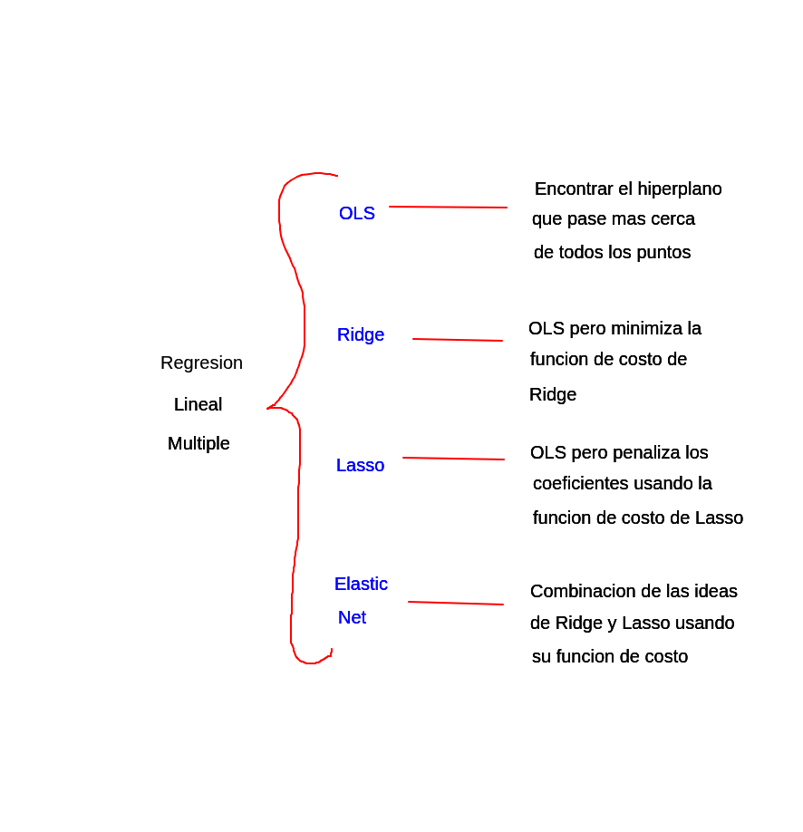

# Análisis de Datos [Teo 1 - Viernes 15:20 - 17:30]
## Notas adicionales

- Temario
	1. Análisis Estadístico Unidimensional
	2. Análisis de Regresión Lineal
	3. Métodos de clasificación y agrupamiento
- Evaluaciones
	- Taller individual (tarea) - 30% - 5/sept
	- Taller grupal (caso) - 20% - 10/oct
	- Prueba de desarrollo - 20% - 14/nov
	- Exposición - 25% - 28/nov
	- Autoevaluación - 5% - 28/nov
## 2025-08-22

"Mucha información en colores y un par de ejes"

El análisis de datos puede definirse como un proceso intrincado y multifacético que implica la aplicación sistemática y rigurosa de técnicas matemático-estadísticas, algoritmos computacionales, y metodologías cuantitativas y cualitativas, con el fin de descomponer, examinar y transformar conjuntos de datos, frecuentemente vastos y heterogéneos, en representaciones más manejables y estructuradas, permitiendo así la extracción de información significativa, la identificación de patrones y correlaciones, y la derivación de inferencias que sustenten la toma de decisiones informadas en contextos diversos, ya sean académicos, científicos, industriales o comerciales, siempre teniendo en cuenta las limitaciones inherentes a los datos, la complejidad de los modelos analíticos, y las posibles implicaciones éticas y operativas de las conclusiones obtenidas y bla bla bla bla bla bla bla bla bla bla bla bla bla bla bla bla bla bla bla bla bla bla bla bla bla bla bla bla bla bla bla bla bla bla bla bla bla bla bla bla bla bla bla bla bla bla bla bla bla bla bla bla

Nuestro cerebro tiene mecanismos para detectar patrones en el mundo que nos rodea; nos ayudan a identificar regularidades y relaciones en los estímulos sensoriales (como reconocer rostros) -> Pareidolia: fenómeno psicológico que implica la percepción de patrones en *estímulos aleatorios o vagos* -> Apofenia: fenómeno psicológico que refiere a la tendencia general de personas a encontrar patrones o conexiones significativos en datos o estímulos aleatorios o sin relación.

La **correlación** indica qué tan fuerte y en qué dirección dos variables están relacionadas, si una cambia ¿cómo cambia la otra?

En el análisis de datos es esencial combinar herramientas estadísticas con el criterio experto:
- Herramientas estadísticas
	- Precisión, reducción de sesgos, cuantificación de incertidumbre.
- Criterio experto
	- Interpretación de resultados en su contexto.

El **CRISP-DM** es una metodología usada para guiar el proceso de análisis y minería de datos: flexible y estructurado.
1. Comprensión del Problema de Negocio
2. Comprensión de los Datos
3. Selección y Preparación de los Datos
4. Modelado de Datos
5. Evaluación
6. Visualización
7. Toma de Decisiones

Leer **Storytelling with Data**.

## 2025-08-29

**Criterio propio** acompañado de herramientas estadísticas. Visión atemperada como expertos.
Los gráficos deben ser sencillos de entender.

#### Combinación de conjuntos de datos de dos o más archivos distintos
Merge (Unión completa) -> FULL OUTER JOIN (SQL)
Join interno -> INNER JOIN (SQL)
Join externo -> LEFT OUTER JOIN, RIGHT OUTER JOIN, FULL OUTER JOIN (SQL)

Tradeoff: ¿Qué tanto problema es tener datos nulos al hacer una unión?

#### Selección de subconjuntos de datos
¿Cómo filtraré los datos? -> Muestras
Ventajas de usar subconjuntos:
- Reducción de complejidad (menos datos)
- Enfoque específico (sin datos irrelevantos)
- Mayor interpretabilidad (contexto definido)

#### Creación, eliminación y transformación de variables
Variables nuevas más valiosas que cualquier columna (i.e. KDA)
Estandarización: Los datos tendrán una media de 0 y desviación estándar de 1, útil cuando las variables tienen distintas unidades y se desean comparar -> Ley de los grandes números
Siempre hay que considerar la *temporalidad* de los datos para tener decisiones más precisas.

Dato mata relato (es cine).

## 2025-09-05

#### Valores nulos
Examen sin nombre, el profesor tiene 3 opciones:
- Eliminarlo y perder la información
- Asignar un nombre al azar
- *Imputar* el dato buscando el nombre en base a pistas (como el tipo de letra)

#### Francis Galton
Se le recuerda especialmente por dos aportes claves en el análisis de datos:
- La regresión a la media
- El diagrama de Galton o gráfico de dispersión
##### Regresión a la media
Observó que cuando se mide (por ejemplo) la altura, los hijos tienden a estar más cerca del promedio de la población que los padres extremos -> Los hijos serán altos pero no tan altos como los padres
##### Outliers
Observó que algunos individuos tenían características que se **desviaban significativamente de la media** -> *datos atípicos*.
Las observaciones pueden deberse a:
- Errores de medición
- Condiciones experimentales inusuales
- Representar fenómenos raros pero significativos
###### Tratamiento
Nota: Solo hacer 1 vez el ajuste de outliers a la media, si siguen habiendo outliers vives con ello
##### Boxplots
Este gráfico es muy común para identificar outliers, muestra la distribución de los datos basándose en cuartiles y destaca explícitamente

OneHotEncoding -> Problema de la dimensionalidad (relacionar con curse of dimensionality)

Nota: revisar cursos aula virtual

## 2025-09-26

Si no hay jerarquía y son muchas clases...
Frequency encoding: crea una columna que combina columnas categóricas, luego se reemplazan los valores combinados por la frecuencia de la clase.

### Gráficos de dispersión

Representa la relación entre dos variables.
Funciona para identificar relaciones (cómo cambia una variable en función de la otra) y detectar patrones (o incluso outliers).
Las variables no siempre cambian de forma independiente; a veces sus variaciones están relacionadas (positiva o negativamente) -> covarianza: medida que indica la dirección de la relación linea entre dos variables.

### Covarianza

Calcula cómo varían conjuntamente dos variables alrededor de sus medias.
- Si $cov(x,y) \gt 0$, cuando $x$ aumenta, $y$ tiende a disminuir.
- Si $cov(x,y) \lt 0$, cuando $x$ disminuye, $y$ tiende a aumentar.
- Si $cov(x,y) \approx 0$, no hay relación lineal clara.
Sin embargo, **la magnitud de la covarianza no dice nada**.

### Correlación de Pearson

Normaliza la covarianza dividiéndola por las desviaciones estándar de cada variable.
- Si $r=1$ hay una relación perfectamente positiva.
- Si $r=-1$ hay una relación perfectamente negativa.
- Si $r=0$ no hay una relación lineal.

Además, hay otros tipos de correlación como el *rho de Spearman* y la *Tau de Kendall*.

### Correlación y causalidad

**La correlación no implica causalidad**.
La *correlación* es una medida de la relación entre dos variables.
La *causalidad* indica que un cambio en una variable directamente provoca un cambio en otra. Para establecer causalidad se necesitan cumplir tres criterios:
- Temporalidad
	- La causa debe preceder al efecto.
- Covariación
	- Las variables deben estar correlacionadas.
- Eliminación de alternativas
	- No deben existir otras variables que expliquen la relación observada.

## 2025-10-02

IA --> Area de la informatica que busca que las maquinas puedan realizar tareas que requieren inteligencia humana, como la toma de decisiones o la comunicacion en lenguaje natural.

ML --> Rama de la IA que se enfoca en que los sistemas aprendan patrones a partir de datos.
- Regresion
- Clasificacion
- Clustering

DL --> Subconjunto del ML que usa ANN con muchas capas, imitando de forma simple el como funcionan las neuronas humanas.

Generative IA --> Crea contenido nuevo que no existia antes.

### Regresion lineal simple

Queremos trazar una linea recta que explique como cambia Y cuando cambia X (Y=mX+b).
Para encontrar esta recta se usa un metodo llamado OLS (Ordinary Least Squares):
- La idea es ajustar la recta para que la diferencia entre los valores reales y los predichos sea la mas pequeña posible.
- Se minimiza la **suma de los cuadrados de los errores**.

**Modelo**
$$
Y_{i} = \beta_0 + \beta_1X_i + \epsilon_i
$$
**Estimación**
$$
\hat{Y}_i = b_0 + b_1X_i
$$

El numerador de $b_1$ mide la covarianza entre X y Y (como se mueven juntas); el denominador mide la varianza de X (que tanto se dispersa). Esto es la tasa de cambio promedio de Y cuando X cambia en una unidad. El $b_0$ es la media de Y menos $b_1$ por la media de X.

**Error**
$$
e_i = Y_i - \hat{Y}_i
$$

El metodo OLS busca valores de $b_0$ y $b_1$ que minimicen la suma de los ${e_i}^2$.

### Métricas de evaluación en regresión

1. MSE
	- Promedio de errores al cuadrado.
2. RMSE
	- Misma idea que el MSE pero con las mismas unidades de Y.
3. MAE
	- Promedio de la magnitud de los errores sin importar el signo, mas robusto que el MSE frente a errores grandes.
4. $R^2$
	- Proporción de variabilidad de Y que el modelo explica con X.

### Separación del dataset

Se separa en train (70%-80%) y test (20%-30%), con el train entrenamos el modelo y con test lo probamos. Logramos lo siguiente:
- Detectamos el sobreajuste.
- Verificamos la generalización del modelo.

## 2025-10-10

### Ética en el análisis de datos

¿Es ético analizar información sin consentimiento de las personas?

### Sesgos

Los *sesgos de percepción* son como trampas mentales que pueden hacer que interpretemos la información de manera incorrecta. A veces inconscientemente nuestro cerebro nos lleva a ver las cosas de una manera que no es del todo objetiva o precisa.

**Sesgo de confirmación** --> Solo escuchas lo que quieres oir.
**Sesgo de disponibilidad** --> Basamos nuestras decisiones en lo que mas facil recordamos.
**Sesgo de autoridad** --> Tendencia natural de las personas a confiar en figuras de autoridad.
**Sesgo de anclaje** --> Te aferras a la primera impresion o dato que recibes.

Algoritmos que predicen y muestran contenido que es probable que interese o con el que interactues (basado en tu comportamiento anterior), llevando a una *cámara de eco* donde los usuarios solo ven y consumen ideas que refuerzan sus creencias existentes --> *polarización social*.

### Principios de Visualización de Edward Tufte

1. Evitar el desorden. Elimina todos los elementos gráficos que no contribuyan directamente a la comprensión del contenido.
2. Muestra comparaciones.
3. Pensar en los gráficos al pasarlos a tinta: ¿es un desperdicio?
4. Integridad. Los gráficos deben representar los datos de forma precisa y sin distorsión.
5. Integración de texto y gráficos.
6. Contexto para la interpretación.

### Business Intelligence

Tecnologías, aplicaciones y prácticas que se utilizan para recolectar, integrar, analizar y presentar datos de manera que apoyen la toma de decisiones en una organización.
- Integración de datos.
- Análisis de datos.
- Visualización de datos
- Reporting (informes).
- Toma de decisiones.

### Proceso de creación de gráficos efectivos

1. Comunicación inicial con el cliente
	- ¿Objetivo principal?
	- ¿Público objetivo?
	- ¿Qué decisiones espera el cliente?
	- ¿Requisitos específicos?
2. Recopilación y comprensión de datos
	- Análisis preliminar.
3. Planificación y diseño inicial
	- Crear un plan y diseño inicial.
	- Selección de gráficos.
	- Borradores.
4. Feedback del cliente y revisión
	- Presentación del borrador.
	- Revisión del feedback.
5. Desarrollo de iteraciones
	- Crear varias versiones del gráfico.
	- Verificación de datos.
6. Detalles finales y diseño estético
	- Estética y claridad.
	- Revisión de coherencia.
7. Presentación y ajustes finales
	- Presentación final.
	- Realizar ajustes finales.
8. Entrega y seguimiento
	- Proporcionar el gráfico.
	- Ofrecer soporte adicional.

## 2025-10-17

La regresión lineal simple nos da una línea recta.
La regresión lineal múltiple nos da un **hiperplano** ([[Sistemas Inteligentes Teo 1 Viernes 1310 1520#2025-09-05]]) en un espacio con muchas dimensiones.

### Uso de métricas

Las métricas tipo MSE, RMSE, MAE y $R^2$ se tiene que hacer con el conjunto de **test**.

MSE/RMSE/MAE: 0 --> $\infty$ (mientras sea menor mejor)
$R^2$: 0 --> 1 (mientras mas cerca al 1 mejor)

### Regresión lineal múltiple

$$
\hat{y} = b_0 + \sum_{i=1}^{k}b_ix_i = b_0 + b_1x_1 + ... + b_kx_k
$$

#### Ordinary Least Squares (OLS)

Modelo "por defecto" de cualquier regresión lineal. En cada observación hay una diferencia entre lo que el modelo predice y lo que realmente ocurre, esa diferencia es llamada **error individual**:
$$
e_i = y_i - \hat{y}_i
$$
Este residuo puede ser positivo o negativo (subestima o sobreestima). Si simplemente se suman los residuos, estos se cancelarían; es por esto que en el OLS se *elevan al cuadrado* los errores y posteriormente se suman, esa cantidad es llamada **suma de errores cuadráticos (SSE)**:
$$
SSE = \sum_{i=1}^{n}{e_i^2} = \sum_{i=1}^{n}{(y_i - \hat{y}_i)^2}
$$
El OLS busca los coeficientes $b$ que **minimizan la suma total de errores cuadrados**.

Para ello se deriva la expresión con respecto a cada $b_i$ y se igualan a cero, resolviendo el sistema resultante se llega a la solución exacta en forma matricial:
$$
\mathbf{b} = \mathbf{(X^T X)^{-1}X^TY}
$$

Este método **NO ES ITERATIVO**, a diferencia de los otros tres que comienzan con una estimación inicial, calculan el error, ajustan los coeficientes y vuelven a medir el error en un ciclo hasta que los cambios dejan de ser significativos.

#### Ridge

También llamada **L2 Regularization** es una versión modificada de la regresión lineal múltiple. Se usa principalmente cuando tenemos muchos predictores o variables muy correlacionadas entre sí.

En lugar de minimizar solo el $SSE$, Ridge minimiza una función que combina dos partes:
$$
\sum_{i=1}^{n}{(y_i - \hat{y}_i)^2} + \lambda \sum_{j=1}^{k}{b_j^2}
$$
El primer término es el mismo del OLS y mide qué tan bien el modelo se ajusta a los datos, el segundo término es la penalización que se aplica a los coeficientes grandes.

El parámetro $\lambda$ controla la intensidad de la penalización (los coeficientes se encogen hacia cero). El objetivo es **encontrar un equilibrio entre ajuste y estabilidad**, esta regresión no busca solo que el modelo prediga bien los datos actuales, sino que también sea más robusto frente a nuevas observaciones.

En la práctica, Ridge **suaviza** los coeficientes (nunca los vuelve cero pero los reduce lo suficiente para evitar que una variable domine el modelo o que los pesos se disparen por correlaciones internas).

#### Lasso

Significa *Least Absolute Shrinkage and Selection Operator* y es otro tipo de modelo lineal regularizado. Busca y hace lo mismo que [[#Ridge]] pero hace que algunos valores que no aporten nada al modelo se vayan a cero debido a su penalización:
$$
\sum_{i=1}^{n}{(y_i - \hat{y}_i)^2} + \lambda \sum_{j=1}^{k}{|b_j|}
$$ El segundo término es la **penalización L1** basada en el valor absoluto de los coeficientes, ¿la consecuencia? **Algunos coeficientes pueden volverse exactamente cero**. En otras palabras, Lasso *selecciona variables* eliminando aquellas que no aportan información útil.

Es por esto que se dice que Lasso hace *regularización* y *selección de variables*.

#### Elastic Net

Combina [[#Ridge]] y [[#Lasso]] en su función de costo (sus penalizaciones) y los varía para aprovechar sus ventajas y compensar sus debilidades: busca un modelo estable como Ridge y una selección de variables como Lasso:
$$
\sum_{i=1}^{n}{(y_i - \hat{y}_i)^2} + \lambda_1 \sum_{j=1}^{k}{|b_j|} + \lambda_2 \sum_{j=1}^{k}{b_j^2}
$$

En la práctica, se controla la mezcla entre ambas penalizaciones usando un parámetro $\alpha$ que define qué proporción de cada una se usa.

### Visualización

Se introduce una variable que suma todas las demas --> Correlacion alta con cada variable.
Se introducen dos variables nuevas con poco ruido gaussiano --> Variables redundantes o mal definidas.

Resultados? OLS, Lasso y Ridge se sobreajustan y tienen valores "buenos" en las métricas, mientras que Elastic Net no (sin embargo no hace un buen ajuste, aunque generalizado).

### Multicolinealidad

Problema de *multicolinealidad* --> Una variable "hace trampa" porque absorbe casi todo el peso del modelo (es decir, se olvidan todas las demás variables por la alta correlación con la feature de interés) --> Las demás variables obtienen coeficientes negativos o distorsionados (ilógico porque el modelo está "compensando" redundancias internas).

La **multicolinealidad** ocurre cuando una variable explicativa puede ser expresada casi como una **combinación lineal de otras**.

Este es un problema porque los coeficientes se vuelven **inestables**, pequeños cambios en los datos producen grandes cambios en los coeficientes; así, el modelo **no logra distinguir cuál variable explica la variación** de la variable objetivo.

#### Factor de Inflación de Varianza

Para detectar la *multicolinealidad*, se usa el **Variance Inflation Factor (VIF)**. Este índice mide cuánto se infla la varianza de un coeficiente estimado debido a la multicolinealidad.
$$
{VIF}_i = \frac{1}{1-R^2_i}
$$
donde $R^2_i$ es el coeficiente de determinación al **regresar la variable** $X_i$ contra todas las demás variables predictoras. Si $X_i$ está altamente correlacionada con las demás, $R^2_i$ será alto, y por tanto el VIF también.

| VIF    | Interpretación               | Acción recomendada                         |
| ------ | ---------------------------- | ------------------------------------------ |
| 1 - 5  | Correlación baja o aceptable | No requiere intervención                   |
| 5 - 10 | Multicolinealidad moderada   | Revisar relaciones y redundancias          |
| > 10   | Multicolinealidad severa     | Eliminar, combinar o regularizar variables |

### Data Leakage

Ocurre cuando un modelo usa información durante el entrenamiento que **no estaría disponible al momento de hacer la predicción**, haciéndolo parecer preciso hasta que es usado en aplicaciones reales (*target leakage*).

Un ejemplo es un dataset que contiene información sobre fraudes de tarjetas de crédito, un modelo podría hacer buenas predicciones en la validación si es que existe una columna de devolución de fondos ya que tendría una alta correlación con la variable que se quiere predecir. Sin embargo, este valor (verdadero o falso) no estaría disponible al momento de hacer la predicción, ocasionando un pésimo rendimiento en la vida real.

También es cuando datos de entrenamiento y validación son usados para crear un modelo, frecuentemente debido a una mala separación o preprocesamiento de los datos.

Un ejemplo de esto es la normalización de un conjunto de datos *antes de* separarlo, al hacerlo indirectamente se "sesga" al modelo ya que indirectamente "verá" información del conjunto de prueba durante el entrenamiento ("hace trampa"), lo que reduce su habilidad de generalizar.

### Consultas via mail

1. ¿Hay una razón por la que la variable *speed* tiene un mayor VIF que la variable total?
	- El VIF no depende *solo* de una correlación aislada, sino de **todas las correlaciones simultáneas** entre una variable y las demás del modelo; así que es posible que *speed* esté correlacionada con varias variables al mismo tiempo, por lo que eleva su VIF.
2. ¿La regresión Lasso (y por ende en cierta parte la Elastic Net) sirven como reducción de dimensionalidad?
	- Efectivamente, ya que *Lasso* penaliza los coeficientes de manera que algunos se reducen a cero, realizando una **selección automática** de variables.
	- Hay otros métodos como *random forest* que tiene algo llamado *feature importance* que permite estimar de otra manera cuáles son las variables más relevantes.
	- También existe algo llamado *SHAP* que es una librería para realizar inteligencia artificial explicable (XAI) que usa cálculos de teoría de juegos para averiguar qué variables tienen más influencia en las predicciones de las técnicas de machine learning. Este framework permite que *cualquier* algoritmo de aprendizaje automático sea esencialmente "explicado" "al proporcionar visualizaciones intuitivas e interactivas que apuntan a mostrar qué características son más relevantes para una determinada predicción y para el modelo en su conjunto". (Consultable en https://es.wikipedia.org/wiki/SHAP)
3. ¿En qué basa su criterio en elegir la mediana o media (o en realidad cualquier medida de tendencia central) para la imputación de valores?, ¿cómo saber si lo que decidí es algo "correcto"?
	- Depende del tipo de variable y la distribución de los datos:
		- Simétricos y sin valores extremos --> media
		- Sesgos o outliers --> mediana
	- Lo importante es observar el efecto de la imputación, por ejemplo viendo si las distribuciones y el desempeño del modelo se mantienen estables después del proceso.
	- Se podrían generar dos datasets: dataset_media y dataset_mediana, haciendo una regresión Lasso podemos elegir el "mejor" de acuerdo al que tenga mejores métricas RMSE, MSE, MAE y $R^2$ (mejor rendimiento).
	- Por simplicidad se elige una u otra de manera arbitraria, pero hay un pensamiento *fuera de la caja* que consiste en usar métodos de regresión para realizar la imputación, esta idea se llama **iterative imputer**. Posteriormente se usa esa regresión para hacer otra regresión (explota la cabeza).

Consultar curso de data science https://drive.google.com/drive/folders/1FTVWhJxuonzamFkv0HjAsT6g6iGba5Kt?usp=drive_link

