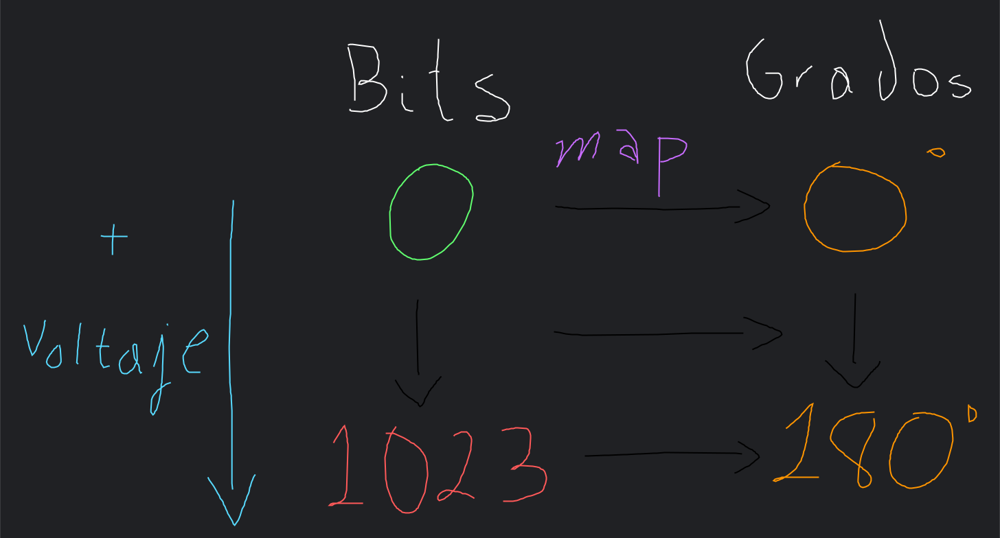
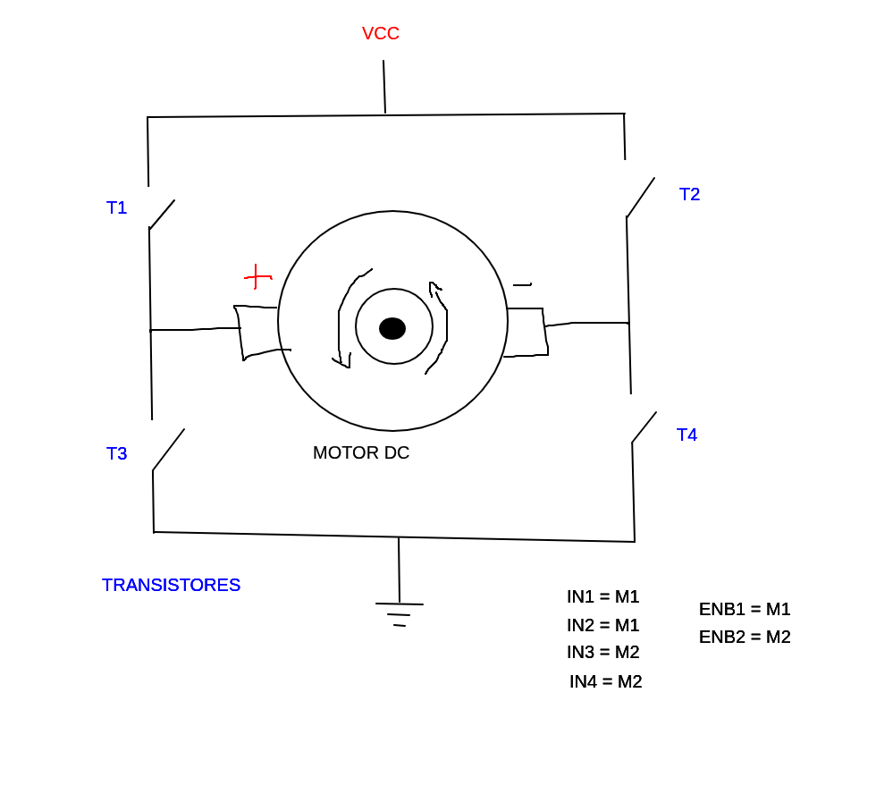

# Programación IoT [Teo 1 | Lunes 13:10 - 15:20]

## 2025-08-11

Sólo hicimos este semáforo :) https://www.tinkercad.com/things/3lAgeAZ7f85-semaforo

## 2025-08-18

La mayoría de los servomotores usan una librería en general, a menos que cambien sus ejes. Un motor convencional gira sin control 360°, sin embargo un _servomotor_ tiene engranajes y un controlador que maneja las revoluciones del motor; además, se diferencian según su potencia y los grados de giro.

En los motores de paso, se puede imaginar que cada uno de los ejes es como un reloj, de esa manera se puede girar de forma precisa el eje.

<div style="display: flex; justify-content: center; align-items: center; gap: 20px">
    <figure>
    	
        <figcaption>Motor DC por dentro</figcaption>
    </figure>
    <figure>
    	
        <figcaption>Servomotor por dentro</figcaption>
    </figure>
    <figure>
    	
        <figcaption>Motor de paso por dentro</figcaption>
    </figure>
</div>

Digital --> 0 ó 1 (bajo o alto voltaje)

Analógico --> Rango indefinido (de voltaje, pueden ser 3.3V, 5V, 10V...)

<div style="display: flex; justify-content: center; align-items: center; gap: 20px">
    <figure>
    	
        <figcaption>Potenciómetro por dentro</figcaption>
    </figure>
</div>

La pata central del potenciómetro es la que da el voltaje; generalmente no importa el orden de las terminales (porque no tiene dirección) a menos que se indique en el potenciómetro en sí.

```c++
#include <Servo.h>
Servo SERVOMOTOR;
const byte POTENTIOMETER_PIN = A0;
const byte SERVO_PIN = 2;
const byte LED_PINS[9] = {3, 4, 5, 6, 7, 8, 9, 10, 11};

void setup() {
  SERVOMOTOR.attach(SERVO_PIN);
  Serial.begin(9600);
  for (byte i = 0; i < 9; i++) {
    pinMode(LED_PINS[i], OUTPUT);
  }
  turnOffLeds();
}

void loop() {
  int angle = moveServo();
  useLeds(angle);
  delay(100);
  turnOffLeds();
}

int moveServo() {
  int value = analogRead(POTENTIOMETER_PIN);
  // El mappeo funciona como en la imagen de abajo
  int ang = map(value, 0, 1023, 0, 180);
  SERVOMOTOR.write(ang);
  Serial.print("El valor del potenciometro es: ");
  Serial.print(value);
  Serial.print(" El angulo del eje es: ");
  Serial.println(ang);
  return ang;
}

// temp/20+3 da el valor del pin porque temp es múltiplo de 20 y se empieza desde el pin 3
void useLeds(int ang) {
  if (ang > 0) {
    int temp = 0;
    while (ang > temp) {
      digitalWrite(temp / 20 + 3, HIGH);
      temp += 20;
    }
  }
}

void turnOffLeds() {
  for (byte i = 0; i < 9; i++) {
    digitalWrite(LED_PINS[i], LOW);
  }
}
```

<div style="display: flex; justify-content: center; align-items: center; gap: 20px">
    
</div>

La actividad final fue: https://www.tinkercad.com/things/0n1ktsi5mxZ-movimiento-de-un-servomotor

## 2025-08-25
Puente h (L293D) -> Componente integrado que permite invertir la polaridad de tensión aplicada a una carga; generalmente se usa para permitir a un motor DC girar en ambos sentidos.

<div style="display: flex; justify-content: center; align-items: center; gap: 20px">
    <figure>
    	
        <figcaption>Partes de un puente H</figcaption>
    </figure>
</div>

Electrónicamente funciona de la siguiente manera:
<div style="display: flex; justify-content: center; align-items: center; gap: 20px">
    
</div>

**NUNCA HAY QUE TENER AMBOS PINES DE ENTRADA DE UN MOTOR EN HIGH**
Los enables modifican el voltaje de entrada al motor (ya sea 1 o 2).
Invierte el sentido ya que controlamos qué par de transistores vamos a usar, de esa forma cambiamos la polaridad y se logra cambiar el sentido del giro del motor.