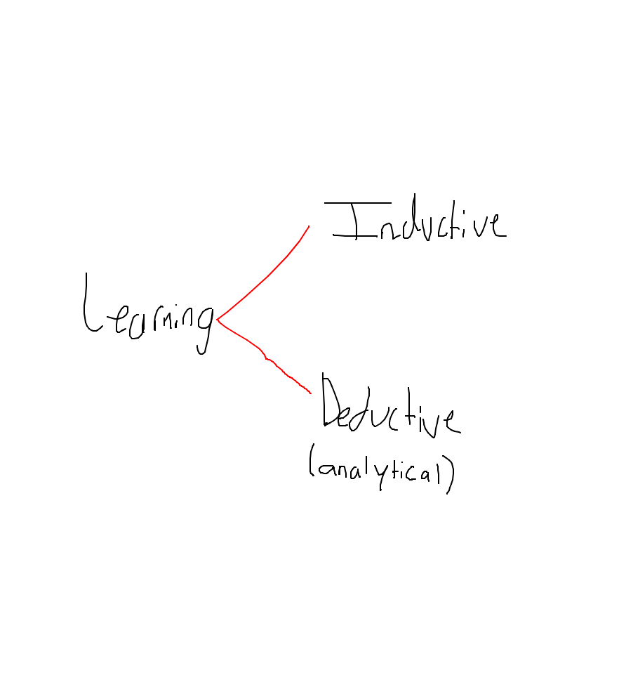

## 18. Learning From Examples

An agent is **learning** if it *improves* its performance on future tasks after making observations about the world.
"From a collection of input-output pairs, learn a function that predicts the output for new inputs."

### 18.1. Forms Of Learning

Inputs that form a **factored representation** (a vector of attribute values) and outputs that can be either a continuous numerical value or a discrete value.

Learning a general function or rule from specific input-output pairs --> inductive learning
Going from a known general rule to a new rule --> deductive learning (analytical)

There are three types of *feedback* that determine the three main types of learning:
- In **unsupervised learning** the agent learns patterns in the input even though **no explicit feedback** is supplied. For example, clustering: detecting potentially useful clusters of input examples.
- In **reinforcement learning** the agent learns from a series of reinforcements (**rewards or punishments**).
- In **supervised learning** the agent observes **some example input-output pairs** and learns a function that maps from input to output.

Both noise and lack of labels create a continuum between supervised and unsupervised learning: **semi-supervised learning**, here we are given a few labeled examples and must make what we can of a large collection of unlabeled examples.

### 18.2. Supervised Learning

The *task of supervised learning* is the following:
Given a **training set** of $N$ example input-output pairs $(x_1, y_1), (x_2, y_2), ..., (x_N, y_N)$ where each $y_j$ was generated by an unknown function $y=f(x)$, discover a function $h$ that approximates the true function $f$.
Here $x$ and $y$ can be any value (not just numerical). The function $h$ is a hypothesis.

Learning is a search through the space of possible hypotheses for one that will perform well, even on new examples beyond the training set. To measure its accuracy, we give it a **test set** of examples that are distinct from the training set.

We say a hypothesis **generalizes** well if it correctly predicts the value of $y$ for new examples. Sometimes $f$ is stochastic, meaning it is not strictly a function of $x$, so we have to learn a conditional probability distribution $P(Y|x)$.

When the output $y$ is one of a finite set of values, the learning problem is called **classification**.
When $y$ is a number, the learning problem is called **classification**.

How do we choose from among multiple consistent (that agrees with all the data) hypotheses?
--> We prefer the **simplest** hypothesis consistent with the data. This principle is called **Ockham's razor**.
In general, there is a *tradeoff* between complex hypotheses that fit the training data well and simpler hypotheses that may generalize better.

## 18.6 Regression and Classification with Linear Models

???

## 18.7. Artificial Neural Networks

Neural networks, connectionism, parallel distributed processing, and neural computation --> All the same.

Roughly speaking, the neuron shown in the image bewlo "fires" when a linear combination of its inputs exceeds some (hard or soft) threshold, which means it implements a linear classifier.

![[Pasted image 20251008121714.png]]

A **neural network** is just a collection of units connected together; the properties of the network are determined by its topology and the properties of the "neurons".

#### 18.7.1. Neural networks structures

Neural networks are composed of nodes or **units** connected by directed **links**.

A link from unit $i$ to unit $j$ serves to propagate the **activation** $a_i$ from $i$ to $j$. Each link also has a numeric **weight** $w_{i,j}$ associated with it, which determines the strength and sign of the connection. Just as in linear regression models, each unit has a dummy input $a_0 = 1$ with an associated weight $w_{0,j}$. Each unit $j$ first computes a weighted sum of its inputs:
$$
in_j = \sum_{i=0}^{n}{w_{i,j}a_i}
$$Then applies an **activation function** *g* to this sum to derive the output
$$
a_j = g(in_j) = g\left(\sum_{i=0}^{n}{w_{i,j}a_i}\right)
$$

The activation function *g* is typically either a hard threshold (**perceptron**), or a logistic function (**sigmoid perceptron**). Both of these nonlinear activation functions ensure that the entire network of units **can represent a nonlinear function**, just that the logistic activation function has the advantage of being differentiable.

How to connect the neurons together after deciding their mathematical model to form a network?

A **feed-forward network** has connections only in one direction (forming a directed acyclic graph). Every node receives input from "upstream" nodes and delivers output to "downstream" nodes; there are no loops. A feed-forward network represents a function of its current input; thus, it has **no internal state** other than the weights themselves.

A **recurrent network** feeds its outputs back into its own inputs. Meaning that the activation levels of the network form a dynamical system that *may* reach a stable state or exhibit oscillations or even chaotic behavior. Moreover, the response of the network to a given input **depends on its initial state**, which may depend on previous inputs. Hence, recurrent networks can support **short-term memory**.

Feed-forward networks are usually arranged in *layers*, such that each unit receives input only from units in the *immediately preceding* layer.

**Hidden units** --> Units not connected to the output of the network.

Sometimes, multiple outputs are required. For example when categorizing images of handwritten digits, it is common to use one output unit for each class.

#### 18.7.2. Single-layer feed-forward neural networks (perceptrons)

A network with all the inputs connected directly to the outputs is called a **single-layer neural network**, also known as **perceptron network**.

We can notice that a perceptron network with $m$ outputs is really $m$ separate networks because each weight affects only one of the outputs. Thus, there will be $m$ separate training processes.

If any training process (whether it is the *perceptron learnining rule* or the *gradient descent rule*) is used for training a perceptron network to learn the two-bit adder function, something interesting happens. The unit in charge of the sum function fails to learn it because a linear classifier represents linear decision boundaries in the input space, and the sum function is an XOR of the two inputs, a not linearly separable function! (as seen in the figure below).

A line that correctly separates both classes can not be created, therefore the XOR function is not *linearly separable*, and thus the unit fails to learn it. A correct approach would be to use a non-linear function, as also seen in [[Sistemas Inteligentes Teo 1 Viernes 1310 1520#Introducción a las redes neuronales (NN)]].

This was a significant setback to neural networks, but perceptron networks can be very effective in some cases. For example, it can represent some quite "complex" Boolean functions very compactly, such as the *majority function* using each $w_i = 1$ and $w_0 = -n / 2$, while a decision tree would need exponentially many nodes to represent this function.

#### 18.7.3. Multilayer feed-forward neural networks

In 1943, McCulloch and Pitts were well aware that a single threshold unit would not sove all their problems. Their paper proves that such a unit can represent the basic Boolean AND, OR, and NOT and then argues that ***any* desired functionality can be obtained by connecting large numbers of units into (possibly recurrent) networks of arbitrary depth**.
There was a very small problem: **nobody knew how to train such networks**.

This turns out to be an easy problem if we think of a network the right way --> as a function $h_w(x)$ parameterized by the weights $w$.

Using the simple network shown below as an example, imagine an input vector $\mathbf{x} = (x_1, x_2)$, the activations of the input units are set to $(a_1, a_2) = (x_1, x_2)$. Then, the output at unit 5 is given by
$$
a_5 = g(w_{0,5} + w_{3,5}a_{3} + w_{4,5}a_{4})
$$
But remember that $a_3$ and $a_4$ are dependant of the output of the activation function in their respective unit, so
$$
a_5 = g(w_{0,5} + w_{3,5}g(w_{0,3} + w_{1,3}a_{1} + w_{2,3}a_{2}) + w_{4,5}g(w_{0,4} + w_{1,4}a_{1} + w_{2,4}a_{2}))
$$
which is equal to
$$
a_5 = g(w_{0,5} + w_{3,5}g(w_{0,3} + w_{1,3}x_{1} + w_{2,3}x_{2}) + w_{4,5}g(w_{0,4} + w_{1,4}x_{1} + w_{2,4}x_{2}))
$$

Thus, we have the **output expressed as a function of the inputs and the weights**. A similar expression holds for unit 6. As long as the derivatives of such expressions with respect to the weights can be calculated, the *gradient-descent loss-minimization* method can 