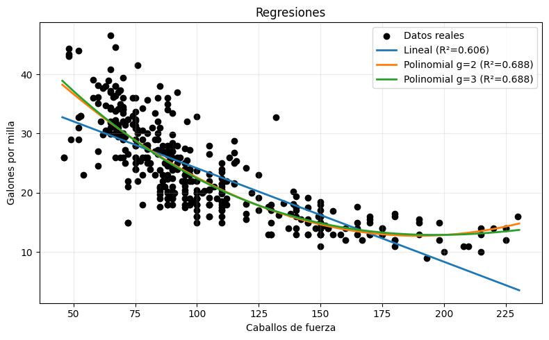
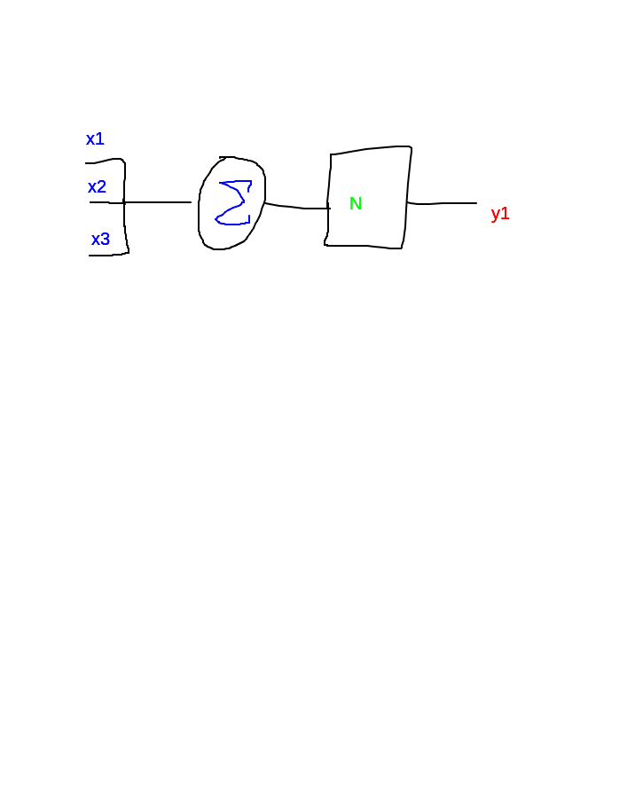
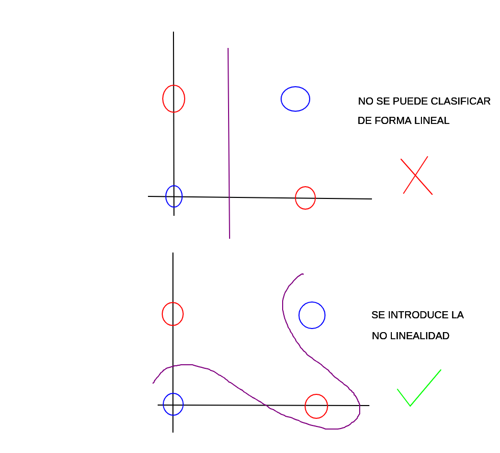

# Sistemas Inteligentes [Teo 1 - Viernes 13:10 - 15:20]
## Notas adicionales
### Forma de evaluación
- 3 evaluaciones teóricas (una por módulo, 20% cada una, a papel)
- Trabajo Final Práctico 40% (Informe, código y presentación) (2 a 3 integrantes)
	- ¿Cuál es el problema?
	- ¿Cómo lo resolvimos?
### Módulos
1. Machine Learning
	- Supervisado
		- Regresión
		- Clasificación
	- No Supervisado
		- Clustering
		- Principal Component Analysis
	- Evaluación de modelos
2. Redes Neuronales (Multi-Layer Perceptrons)
	- Perceptrón multicapa
	- Funciones de activación y backpropagation
	- Regularización y Optimización
3. Modelos de Lenguaje Extensos (LLM)
	- Fundamentos de Natural Language Processing y Transformers
	- Prompt Engineering y aplicaciones prácticas
	- Ética y uso responsable de la IA

## 2025-08-15 (Feriado, recuperado)

Aprendizaje supervisado -> Datos con etiquetas (ya damos el patrón).
Aprendizaje no supervisado -> "Aprende" patrones pero no identifica las clasificaciones por la falta de etiquetas.

### Tipos de problemas supervisados
**Regresión**
- Salida continua $$ y \in \mathbb{R} $$
- Predecir el precio de una casa o estimar una temperatura futura
- Predice un número
**Clasificación**
- Salida categórica $$ y \in \set{1, 2, 3, ..., k} $$
- Predice una clase
- Spam, enfermo/sano...

<div style="display: flex; justify-content: center; align-items: center;">
    
</div>

La *regresión lineal* supone una relación unidimensional entre la variable dependiente y la independiente (una linea recta), su objetivo es predecir una variable continua a partir de una o más variables independientes.
$$ \hat{y} = \beta_{0} + \beta_{1}x_{1} + \beta_{2}x_{2} + ... + \beta_{p}x_{p} $$
El aprendizaje en este método consiste en encontrar los coeficientes B que minimicen el MSE (Mean Squared Error) entre las predicciones y los valores reales.
$$ MSE = \frac{1}{N}\sum_{i=1}^{N}{(y_{i}-\hat{y}_i)^2} $$
Se eleva al cuadrado porque si no se hace entonces los positivos se cancelarían con los negativos...

La *regresión polinomial* es un caso especial de la regresión lineal en el que los predictores se elevan a potencias (polinomios) para capturar relaciones no lineales entre la variable independiente y las variables dependientes.
$$ \hat{y} = \beta_{0} + \beta_{1}X + + \beta_{2}X^{2} + ... + \beta_{d}X^{d} $$
```python
# ============================================

# Clase 2 - Regresión Polinomial (Colab-ready)

# Ejemplo: Fertilizante (kg) -> Rendimiento (ton/ha)

# ============================================

import numpy as np
import pandas as pd
import matplotlib.pyplot as plt
from sklearn.pipeline import Pipeline
from sklearn.preprocessing import PolynomialFeatures
from sklearn.linear_model import LinearRegression
from sklearn.metrics import mean_squared_error, r2_score

# 1) Datos (puedes cambiarlos y experimentar)
X = np.array([1, 2, 3, 4, 5, 6], dtype=float).reshape(-1, 1) # fertilizante (kg)
y = np.array([1.2, 1.9, 3.2, 3.8, 4.1, 4.2], dtype=float) # rendimiento (ton/ha)

# 2) Definir modelos: lineal, polinomial grado 2 y grado 3
models = {
	"Lineal (g=1)": Pipeline([
		("poly", PolynomialFeatures(degree=1, include_bias=False)),
		("linreg", LinearRegression())
	]),
	"Polinomial g=2": Pipeline([
		("poly", PolynomialFeatures(degree=2, include_bias=False)),
		("linreg", LinearRegression())
	]),
	"Polinomial g=3": Pipeline([
		("poly", PolynomialFeatures(degree=3, include_bias=False)),
		("linreg", LinearRegression())
	]),
}

# 3) Entrenar y evaluar
results = {}
for name, pipe in models.items():
	pipe.fit(X, y)
	y_hat = pipe.predict(X)
	rmse = np.sqrt(mean_squared_error(y, y_hat))
	r2 = r2_score(y, y_hat)
	results[name] = {
		"model": pipe,
		"rmse": rmse,
		"r2": r2
	}
	
	print(f"{name}: RMSE={rmse:.4f} | R²={r2:.4f}")

# 4) Mostrar coeficientes (para interpretación)
def pretty_coefs(pipe, name):
	# Obtiene coeficientes del modelo lineal dentro del pipeline
	lin = pipe.named_steps["linreg"]
	coefs = lin.coef_
	intercept = lin.intercept_
	
	print(f"\n{name} → Intercepto: {intercept:.4f}")
	
	for i, c in enumerate(coefs, start=1):
		print(f" beta_{i}: {c:.4f}")

for name, info in results.items():
	pretty_coefs(info["model"], name)

# 5) Curvas suaves para graficar
X_plot = np.linspace(X.min()-0.5, X.max()+0.5, 200).reshape(-1, 1)
y_lineal = results["Lineal (g=1)"]["model"].predict(X_plot)
y_poly2 = results["Polinomial g=2"]["model"].predict(X_plot)
y_poly3 = results["Polinomial g=3"]["model"].predict(X_plot)

# 6) Gráfico comparativo
plt.figure(figsize=(8,5))
plt.scatter(X, y, color="black", label="Datos reales")
plt.plot(X_plot, y_lineal, label=f"Lineal (R²={results['Lineal (g=1)']['r2']:.3f})", linewidth=2)
plt.plot(X_plot, y_poly2, label=f"Polinomial g=2 (R²={results['Polinomial g=2']['r2']:.3f})", linewidth=2)
plt.plot(X_plot, y_poly3, label=f"Polinomial g=3 (R²={results['Polinomial g=3']['r2']:.3f})", linewidth=2)

plt.title("Regresión lineal vs polinomial")
plt.xlabel("Fertilizante (kg)")
plt.ylabel("Rendimiento (ton/ha)")
plt.grid(True, alpha=0.25)
plt.legend()
plt.tight_layout()

plt.show()

# 7) Notas rápidas (texto en consola)
print("\nNotas:")
print("- Observa cómo el polinomio g=2 captura la curvatura (aumento inicial y estabilización).")
print("- El g=3 puede ajustarse aún más, pero ten cuidado con el sobreajuste si hubieran ruidos/datos extra.")
print("- En práctica, se debe validar el grado con validación cruzada y/o un set de validación separado.")
```

La *regresión logística* resuelve un problema de **clasificación** usando un método de regresión. Surge de que la regresión lineal no puede ser acotada. Esta regresión usa la función sigmoide que toma cualquier número real y lo convierte en un valor entre 0 y 1. Es bueno escalar los datos antes de aplicar la regresión logística.
$$ P(y=1|x) = \sigma(\beta_{0} + \beta_{1}x_{1} + \beta_{2}x_{2} + ... + \beta_{p}x_{p}) $$
$$ \sigma(z) = \frac{1}{1+e^{-z}} $$
Si P >= 0.5 entonces se clasifica como 1, si P<0.5 como 0. Mapeo.

**Métricas**
El *RMSE* (Root Mean Squared Error) mide el promedio de la magnitud de los errores entre las predicciones y los valores reales; además, está en las mismas unidades que la variable objetivo (+interpretación).
$$ RMSE = \sqrt{\frac{1}{N}\sum_{i=1}^{N}{(y_{i}-\hat{y}_i)^2}}  $$

El *R^{2}* (coeficiente de determinación) mide la proporción de la varianza de la variable dependiente explicada por el modelo. En el numerador está la suma de errores al cuadrado (SSE -> variación no explicada) y en el denominador es la suma total de cuadrados (SST -> variación total de los datos). Mientras más cerca al 1, es mejor.
$$ R2(y, \hat{y}) = 1 - \frac{\sum_{i=1}^{N} (y_i - \hat{y}_i)^2}{\sum_{i=1}^{N} (y_i - \bar{y})^2} $$

**Taller**
Observando la gráfica podemos concluir que un ajuste polinomial es mejor a uno lineal. También podemos notar que no hay tanta diferencia entre los rendimientos de los modelos polinomiales, sin embargo se puede sospechar de un *overfitting* conforme se incrementa el grado del polinomio pero no hay *underfitting* (por las métricas) para los grados 2 y 3. Habría que tener más datos o un conjunto de validación para demostrar estas conjeturas.

```md
Lineal: RMSE=4.8932, R2=0.6059
Polinomial g=2: RMSE=4.3572, R2=0.6876
Polinomial g=3: RMSE=4.3526, R2=0.6882

Lineal → Intercepto: 39.9359
 beta_1: -0.1578

Polinomial g=2 → Intercepto: 56.9001
 beta_1: -0.4662
 beta_2: 0.0012

Polinomial g=3 → Intercepto: 60.6848
 beta_1: -0.5689
 beta_2: 0.0021
 beta_3: -0.0000
```
<div style="display: flex; justify-content: center; align-items: center;">
    
</div>

## 2025-08-22
#### **Inteligencia - ¿Qué es?**
No hay un concenso para definir la *inteligencia humana* ya que no tiene una definición única.
Objeto de estudio: Machine Learning.
Los sistemas inteligentes son un conjunto de herramientas para resolver problemas pero no todos los problemas deben ser resueltos con inteligencia artificial.

Los algoritmos convencionales son finitos, deterministas y cerrados (ya que no son estocásticos, no tienen dinamismos, no son probabilísticos); estos se pueden asociar más a un árbol (kinda árbol de decisión).
#### ¿Qué define si un sistema puede ser de inteligencia artificial?
Los problemas de la vida real suelen ser dinámicos, si se tiene un problema determinista entonces el **ENTORNO NO CAMBIA** (por ejemplo en las rutas). Un sistema inteligente **IDENTIFICA EL ENTORNO Y TOMA UNA DECISIÓN**.

<div style="display: flex; justify-content: center; align-items: center;">
    
</div>

#### Características y áreas
La IA clásica está basada en reglas y lógica, mientras que los SI se basa en datos, patrones y predicciones. Los Sistemas Inteligentes tienen capacidad de aprendizaje, adaptabilidad, autonomía, generalización e interacción.

ML Supervisado y No Supervisado -> Fundamentales
NN incluyen MLP y DL -> Modelos ppotentes
LLM -> Revolución actual
Sistemas híbridos -> Combinación de reglas para mayor aprendizaje
#### ¿Qué es el Machine Learning?
- Aprendizaje automático
	- Permite que las máquinas aprendan y mejoren sin ser programadas explícitamente.
- Entrenamiento de modelos
	- Identifican patrones y los aplican a nuevos datos.
- Reconocimiento de imágenes

**LOS ALGORITMOS NO PIENSAN Y MUCHO MENOS TIENEN CONCIENCIA**; usan técnicas de predicción estadísticas.

"Nosotros traducimos el mundo a matrices y vectores" -> La máquina no ve, no escucha, no habla; la máquina sólo entiende vectores, matrices y tensores.

Algoritmos -> Pensar en matrices y vectores hace más óptimo todo.
#### Tipos de aprendizaje
- Supervisado
	- Datos etiquetados para entrenar
	- Tareas de clasificación
- No supervisado
	- Patrones en datos sin etiquetas
	- Agrupación, segmentación -> clustering
- Por refuerzo
	- Sistema de recompensas y retroalimentación
	- Se usa en robótica y juegos
#### Flujo de trabajo
1. Recolección y preparación de datos
	1. Recopilar
	2. Limpiar
2. Selección y entrenamiento de modelo
	1. Elección
	2. Entrenamiento
3. Evaluación y despliegue
	1. Uso de métricas
	2. Desplegue
#### Definiciones
- Sistemas Inteligentes
	- Sistema computacional capaz de percibir su entorno, procesar información y tomar decisiones autónomas (o semi) con el fin de resolver problemas.
	- Sistemas que buscan replicar procesos cognitivos en máquinas.
	- Aprenden de la experiencia a través de datos y mejoran su rendimiento con el tiempo.
- Determinista
	- Mismas entradas implica mismas salidas.
- Features
	- Atributos observados por el modelo relevantes para el análisis.
- Label
	- Valor objetivo que el modelo busca predecir.
- Estructura de dataset
	- En aprendizaje supervisado, el dataset contiene tanto los features como labels para entrenar modelos.

### Taller
**K-NEAREST NEIGHBOURS**
Primero se calcula la distancia del nuevo punto con respecto a los demás puntos en el espacio vectorial, luego se ordena la distancia de menor a mayor y finalmente se eligen los *k* puntos más cercanos para la clasificación del nuevo punto.
<div style="display: flex; justify-content: center; align-items: center;">
    
</div>

Accuracy: Comparación entre lo predicho y lo real.
El modelo KNN tiene 2 problemas principales:
1. El modelo no se auto-entrena porque el hiperparámetro *k* se le tiene que dar.
2. Es muy lento con demasiados datos porque tiene que hacer *n-1* cálculos por y para cada punto.

Actividad Final: https://colab.research.google.com/drive/1qKkQ27kTGw0JlJ_AXglPLya4cYh5lATM?usp=sharing

## 2025-09-05

Un **hiperplano óptimo** hace referencia a la recta que separa dos espacios (muetras) en 2 o más dimensiones.

#### Árboles de decisión (clasificación)
Tiene 3 tipos de nodos: raíz, intermedios y hojas; en el nodo raíz se ingresan los datos (input) para después irse filtrando mediante los nodos intermedios para llegar finalmente a un nodo hoja con una salida (output). Un **random forest** ocupa varios árboles de decisión.

Los *criterios de partición* se usan para decidir las divisiones que se usarán y el orden según una categoría o característica del conjunto de datos, así un dato seguirá un determinado camino según sus características.

#### Medidas de pureza
##### Entropía de Shannon
Mide la impureza o *desorden* de un conjunto $S$. Mide el orden de un conjunto y el desorden se sabe con respecto a la probabilidad de que salga un dato sobre otro. Cuando la mitad del conjunto es del tipo A y la otra mitad del tipo B (50% de obtener cualquier tipo), entonces se habla del mayor nivel de entropía. Este criterio siempre elige la **característica con menos entropía** (la entropía va de menos certidumbre a mayor certidumbre).
$$
H(S) = - \sum_{i=1}^{k}{p_{i}\log_{2}(p_i)}
$$
##### Ganancia de información
Mide la reducción de entropía después de dividir el conjunto según un atributo.
$$
IG(S, A) = H(S) - \sum_{v \in Values(A)}{\frac{|S_{v}|}{|S|}}H(S_{v})
$$
Donde $S_{v}$ es el subconjunto de datos donde el atributo $A$ toma el valor $v$. Un $IG$ alto implica que la división reduce mucho la incertidumbre (buena división), mientras que un valor bajo significa que no ayuda mucho a dividir las clases.
##### Índice Gini
Mide el nivel de entropía pero a una escala distinta.
$$
Gini(S) = 1 - \sum_{i=1}^{k}{{p_{i}}^2}
$$
##### Varianza reducida (para regresión)
Usa la varianza para buscar la calidad de la partición según el que tenga menor nivel de varianza.
$$
Var(S) = \frac{1}{|S|}\sum_{i=1}^{|S|}{(y_{i} - \bar{y})^{2}}
$$
Donde la métrica de división es la disminución de la varianza tras separar el nodo.

#### Máquinas de Soporte Vectorial (SVM)
El SVM es un algoritmo que busca los mejores planos (superplanos óptimos) para hacer la mejor clasificación. Se busca la **mejor recta** que separe los grupos.

El *truco de Kernel* amplia los conjuntos de datos con una nueva dimensión que sí permite un hiperplano claro, una recta.

## 2025-09-10 (Recuperado del 5 de sept)

El Aprendizaje No Supervisado **no recibe etiquetas** de los datos, su objetivo principal es *descubrir una estructura oculta o patrones* en los datos de entrada.
- Se tiene un conjunto de datos $D=\{x_1, x_2, ..., x_n\}, x_i \in \mathbb{R}^p$ 
- No existen etiquetas $y$ asociadas.
- El algoritmo busca encontrar:
	- Agrupamientos (clustering)
		- Particiones de los datos en subconjuntos
	- Representaciones compactas
		- Reduccion de dimensionalidad
	- Patrones inusuales
		- Deteccion de anomalias
	- Reglas de asociación
		- Descubrir relaciones entre elementos en conjuntos de datos
#### Clustering
El clustering busca agrupar instancias similares en subconjuntos llamados clusters. Los objetos dentro de un mismo cluster deben ser similares entre sí y los objetos en clusters distintos deben ser lo más diferentes posible.
Dado un conjunto de datos $D=\{x_1, x_2, ..., x_n\}, x_i \in \mathbb{R}^p$ se busca una partición $C=\{C_1, C_2, ..., C_k\}$ donde:
- $C_i\subset D$
- $C_i \cap C_j = \emptyset$ si $i \neq j$
- $\bigcup_{i=1}^k{C_i}=D$

| Ventajas                                       | Desventajas                                   |
| ---------------------------------------------- | --------------------------------------------- |
| No requiere etiquetas                          | Resultados dificiles de interpretar           |
| Permite explorar datos sin conocimiento previo | Difícil evaluar la calidad                    |
| Descubre patrones inesperados                  | Generación de clusters artificiales no útiles |
De forma intuitiva, las instancias parecidas se agrupan; se usa una medida de similitud o **distancia**, típicamente:
- Distancia euclidiana
	- $d(x_i, x_j) = \sqrt{\sum_{m=1}^{p}{(x_{im}-x_{jm})^2}}$
- Distancia Manhattan
	- $d(x_i, x_j) = \sum_{m=1}^{p}{|x_{im}-x_{jm}|}$
- Coseno, correlación, etc.
##### Tipos de clustering
- Clustering particional
	- Divide los datos en $k$ clusters;
	- Cada punto pertenece a un cluster.
- Clustering jerárquico
	- Construye un árbol (dendrograma);
	- Puede ser aglomerativo (bottom-up) o divisivo (top-down).
	- El dendrograma permite "cortar" a distintas alturas para obtener diferentes números de clusters, lo que lo hace muy flexible.
- Clustering basado en densidad
	- Detecta clusters de forma arbitraria
	- Útil cuando los clusters no son esféricos o contienen ruido.
##### K-means
Es un algoritmo de clustering particional que busca dividir un conjunto de datos en $k$ grupos, minimizando la distancia entre los puntos y el centroide (media de los puntos asignados) de su cluster.

| Ventajas                               | Limitaciones                                                                         |
| -------------------------------------- | ------------------------------------------------------------------------------------ |
| Fácil de implementar                   | Se debe definir $k$                                                                  |
| Eficiente en datasets grandes          | Sensible a la inicialización (solución variable)                                     |
| Funciona bien con alta dimensionalidad | Supone clusters convexos y de tamaño similar (puede fallar en estructuras complejas) |
| Interpretabilidad                      | Sensible a outliers (pueden mover el centroide)                                      |
###### Algoritmo
1. Se eligen aleatoriamente $k$ centroides iniciales;
2. Cada punto se asigna al cluster cuyo centroide este mas cercano;
3. Se recalculan los centroides como la media de los puntos asignados;
4. Repetir pasos 2 y 3 hasta que los centroides no cambien significativamente (convergencia).
###### Objetivo
Minimizar la Suma de Errores Cuadraticos (SSE) o inercia:
$$
J = \sum_{i=1}^k{\sum_{\forall{x_i \in C_k}}{{||x_i - \mu_i||}^2}} 
$$
###### Observaciones
- Se le dificultan patrones con formas irregulares debido a su limitación esférica.
- Con un valor incorrecto de $k$ se crean clusters innecesarios y erróneos.

##### DBSCAN
Es un algoritmo basado en **densidad**.
- Agrupa puntos cercanos entre sí en regiones densas;
- Puntos aislados (de baja densidad) son considerados ruido o **anomalías**;
- No requiere especificar $k$ ya que se determina automáticamente según los parámetros.
- Cluster -> Región del espacio donde los puntos son densos;
- Las regiones de baja densidad separan diferentes clusters;
- Permite encontrar clusters de formas arbitrarias (no se casa con los centroides).
###### Parámetros principales:
- $\epsilon$ representa el radio maximo de vecindad para cada punto;
- $MinPts$ es el numero minimo de puntos en la vecindad para considerarla densa.
###### Tipos de puntos
- Core point
	- Tiene al menos $MinPts$ dentro de su radio $\epsilon$.
- Border point
	- Tiene menos de $MinPts$ vecinos pero esta dentro del radio $\epsilon$ de un core point.
- Noise point (outlier)
	- No es core ni border, se considera ruido.
###### Algoritmo
1. Para cada punto $x$, calcula su vecindad $N_\epsilon(x) = \{y \in D | d(x,y) \leq \epsilon \}$
2. Si $|N_\epsilon(x)| \geq MinPts$, marcar $x$ como core point y expandir un cluster.
3. Si un punto es alcanzable desde un core point, se asigna al mismo cluster.
	- Si existe una secuencia de core points $p_1, p_2, ..., p_k$ y cada uno dentro de la vecindad de $\epsilon$ del siguiente, entonces son alcanzables entre si.
4. Puntos no alcanzables por ningún core -> ruido.
###### Ventajas y desventajas

| Ventajas                                                      | Limitaciones                                                  |
| ------------------------------------------------------------- | ------------------------------------------------------------- |
| No requiere $k$                                               | Sensible a la elección de los parámetros                      |
| Detecta clusters de forma arbitraria (no necesita convexidad) | Puede fallar si los clusters tienen densidades muy diferentes |
| Identifica ruido y outliers                                   | No escala bien en datasets de muy alta dimensión              |
| Robusto frente a clusters de distinto tamaño y densidad       |                                                               |
###### Observaciones
- Con menor valor $\epsilon$ hay mas valores ruido porque se requiere que los datos esten mas concentrados (e incluso puede crear nuevos clusters muy pequeños), pero si lo aumentamos puede agrupar datos de diferentes clusters y hay menos puntos ruidos.
- Funciona muy bien con patrones con formas irregulares debido a que no tiene una limitación de convexidad.

#### Métricas de evaluación
Significa poder comparar la eficiencia del modelo de forma cuantitativa.
##### Para clasificación
###### Matriz de confusión

| **Matriz de confusión** | Predicción Positiva | Predicción Negativa |
| ----------------------- | ------------------- | ------------------- |
| Clase Real Positiva     | Real Positivo       | Falso Negativo      |
| Clase Real Negativa     | Falso Positivo      | Real Negativo       |
Nota: La dimensión de la matriz depende del número de clases (nxn).
###### Accuracy
$$
Accuracy = \frac{\text{True Positives} + \text{True Negatives}}{\text{All Samples}}
$$
No dice en qué clase es mejor y en cuál mejor, por eso es bueno para tener una visión rápida del desempeño del modelo. No se puede saber por qué exactamente dió ese valor, por eso se junta con otras métricas.

| Ventajas                                                | Desventajas                      |
| ------------------------------------------------------- | -------------------------------- |
| Útil cuando las clases están balanceadas                | No informa rendimiento por clase |
| Útil cuando no hay una asimetría crítica en los errores |                                  |

###### Precision - ¿Qué tan confiable es un positivo?
Mide la proporcion de verdaderos positivos entre todos los ejemplos que el modelo clasificó como positivos.
Te mueves hacia abajo en la matriz de confusión.
De todos los sí, ¿en cuántos tuve razón?
$$
Precision = \frac{\text{True Positives}}{\text{True Positives} + \text{False Positives}}
$$
Es útil en problemas donde tener un **falso positivo es peligroso** (o costoso).
###### Recall (sensibilidad) - ¿Detecto todos los positivos? - Capacidad de detectar positivos
Mide la proporción de ejemplos positivos correctamente clasificados por el modelo.
Te mueves hacia el lado en la matriz de confusión.
De todos los sí reales, ¿cuántos detecté?
$$
Recall = \frac{\text{True Positives}}{\text{True Positives} + \text{False Negatives}}
$$
Útil cuando tener **falsos negativos es peligroso** (o costoso).
###### Specifity - Capacidad de detectar negativos
Mide la proporción de ejemplos negativos correctamente identificados como negativos.
De todos los no reales, ¿cuántos detecté?
$$
Specifity = \frac{\text{True Negatives}}{\text{True Negatives} + \text{False Positives}}
$$
Útil cuando tener **falsos positivos es peligroso** (o costoso).
###### F1-score
Es la media armónica entre precision y recall. Esta media penaliza más fuertemente los valores desbalanceados (por ejemplo, alta precisión pero baja recall).
$$
F_1 = \frac{2 \times (\text{Precision} \times \text{Recall})}{\text{Precision} + \text{Recall}}
$$
Un $F_1 = 1$ indica *máxima precisión y máximo recall*, mientras que un valor bajo indica que una o ambas métricas son deficientes.
###### AUC-ROC (Area Under Curve - Receiver Operating Characteristic)
Es el área bajo una curva que muestra la relación entre el False Positive Rate (eje X) y el True Positive Rate (recall). Un AUC de 1.0 significa un clasificador perfecto, mientras que un 0.5 es interpretado como que es aleatorio, y menor a eso es un modelo invertido.
###### AUC-PR (Area Under Curve - Precision Recall)
La curva Precision-Recall muestra el compromiso entre ambas métricas para todos los posibles umbrales de decisión, esta métrica es una medida global del rendimiento del modelo. En el eje X va el recall mientras que en el eje Y va la precision; cuanto mas cerca de 1, el modelo es mejor identificando positivos correctamente y evitando falsos positivos.

A diferencia del AUC-ROC, no considera los True Negatives, lo que la hace más sensible a la calidad de las predicciones sobre la clase positiva. Solo evalúa la clase positiva y es mejor para clases minoritarias.
##### Para regresión
###### MAE (Mean Absolute Error)
Mide el promedio de las diferencias absolutas entre los valores verdaderos y los valores predichos. No penaliza tanto los errores grandes y por eso es más robusto frente a outliers.
$$
\text{MAE} = \frac{1}{n}\sum_{i=1}^{n}{|y_i-\hat{y}_i|}
$$
###### MSE (Mean Squared Error)
Mide el promedio de los cuadrados de los errores entre las predicciones del modelo y los valores reales. Evalúa que tan lejos están las predicciones en promedio, penalizando más fuertemente los errores grandes.
$$
\text{MSE} = \frac{1}{n}\sum_{i=1}^{n}{(y_i-\hat{y}_i)^2}
$$
###### RMSE (Root Mean Squared Error)
Es la raíz cuadrada del MSE.
$$
\text{RMSE} = \sqrt{\text{MSE}}
$$
###### $R^2$ Score
Mide qué proporción de la varianza total de los datos puede explicar el modelo. Es un indicador de calidad del ajuste del modelo respecto a una línea que predice siempre el promedio
$$
R^2 = 1 - \frac{\text{SSE}}{\text{SST}}
$$
###### MAPE (Mean Absolute Percentage Error)
Mide el error promedio como un porcentaje del valor real, es decir, cuánto se equivoca el modelo en relación al tamaño del valor que intenta predecir.
$$
\text{MAPE} = \frac{100\%}{n} \sum_{i=1}^{n}{|(y_i - \hat{y}_i)/y_i|}
$$
Un MAPE del 10% significa que el modelo en promedio se equivoca un 10% del valor real.
###### MSLE (Mean Squared Logarithmic Error)
Se usa cuando crecen exponencialmente o polinómica. Mide el promedio del cuadrado de las diferencias entre los logaritmos de los valores reales y predichos.
$$
\text{MSLE} = \frac{1}{n}\sum_{i=1}^{n}{(\log(1+\hat{y}_i) - \log(1+y_i))^2}
$$
###### ¿Cómo elegir?
- Usar MAE cuando:
	- Se necesita robustez ante outliers.
	- Los errores deben ser interpretados directamente.
	- Igualdad en la penalización de los errores.
- Usar MSE cuando:
	- Se entrena un modelo con gradiente descendiente: es suavemente diferenciable y favorece la optimización convexa.
	- Es de interés castigar fuertemente los errores grandes.
- Usar RMSE cuando:
	- Se quiere una métrica interpretable pero que penalice los errores grandes.
- Usar MSLE cuando:
	- Es de interés el crecimiento relativo, mas no el valor exacto.
	- Las diferencias porcentuales pequeñas importan más que las absolutas grandes.
	- Estás modelando procesos que crecen exponencial o multiplicativamente.
	- Se quiere penalizar más cuando el modelo subestima que cuando sobreestima.
##### Para clustering
###### Silhouette Score
Puntos de un mismo cluster tienen que estar mas juntos y de distintos clusters más separados -> Cohesión pequeña.
Se aplica para cada punto y se muestra el Silhouette Score global que es el promedio de $s(i)$ sobre todos los puntos $i$.
$$
s(i) = \frac{b(i) - a(i)}{\text{max}(a(i), b(i))} ; s(i) \in [-1, 1]
$$
$a(i)$ -> distancia promedio entre $i$ y todos los demas puntos en el mismo cluster (cohesion)
$b(i)$ -> distancia promedio entre $i$ y todos los demas puntos del cluster mas cercano (separacion)

$s(i) \approx 1$ -> el punto esta bien asignado (lejos de otros clusteres y cerca de su propio cluster)
$s(i) \approx 0$ -> el punto esta en el limite entre dos clusteres
$s(i) \lt 0$ -> el punto esta mal asignado, esta mas cerca de otro cluster que del suyo 
###### DBI (Davies-Bouldin Index)
Mide la calidad de un clustering en función de:
- La dispersión interna de cada clúster -> ¿qué tan compactos son?
- La separación entre clústeres -> ¿qué tan lejos están unos de otros?
Un DBI bajo indica mejor calidad de clustering: clústeres más compactos y bien separados.

Sea $C_i$ un clúster con centroide $\mu_i$ y $S_i$ su dispersión:
$$
S_i = \frac{1}{|C_i|} \sum_{x \subset C_i}{||x-\mu_i||}
$$
La separación entre dos clústeres $C_i$ y $C_j$:
$$
M_{ij} = ||\mu_i - \mu_j||
$$
La "similaridad" entre dos clústeres $i$ y $j$ se define como:
$$
R_ij = \frac{S_i + S_j}{M_{ij}}
$$
Entonces, el DBI se define como:
$$
\text{DBI} = \frac{1}{k}{\sum_{i=1}^{k}{\max_{j \neq i}R_{ij}}}
$$
Es decir, para cada clúster $i$, se toma el peor (mayor) caso de superposición con otro clúster $j$, y se promedia sobre todos los clústeres.

## 2025-09-26

### Introducción a las redes neuronales (NN)

No hay modelos, se construyen redes neuronales que permitan resolver el problema. El proceso original obtiene una nueva etapa:
1. Problema
2. Datos
3. Hipótesis
4. **Diseño de arquitectura**

Las redes se conforman de neuronas conectadas, procesan vectores de entrada y generan salidas no lineales.

1943: McCulloch y Pitts proponen el primer modelo matemático de neurona artificial
Las neuronas naturales no siempre respondían a todos los estímulos. Modelaron un núcleo con $n$ entradas (una combinación lineal) y una salida.


El perceptrón se desarrollo en 1957-1958 por Frank Rosenblatt, es la primera red neuronal entrenable computacionalmente (por los pesos) y se basa en una neurona artificial con aprendizaje supervisado.
![[Pasted image 20250926104613.png]]

Este perceptrón no podía manejar la no linealidad necesaria para procesar el XOR.


Eventualmente se llegó a las **redes neuronales multicapa** (Multi-Layer Perceptron)

Redes Neuronales Convolucionales (CNN) -> Capas de convolución -> Aplican filtros -> Imágenes

Redes Neuronales Recurrentes y LSTM (RNN y Long-Short Term Memory) -> Depende de múltiples estados anteriores -> Bolsa, clima, reconocimiento de voz

Deep Learning (DL) -> 

Avances recientes: Redes adversaliales (GAN) y Large Language Models (LLM)

### Fundamento matemático de las neuronas artificiales

Cada entrada al núcleo está ponderada con un peso inicial desconocido. El núcleo hace una operación lineal (combinación, sumatoria). Hasta ese momento es algo lineal, una *función lineal*; sin embargo, las neuronas reales no son de esa forma.
$$
f(x) = x_{1}w_{1} + x_{2}w_{2} + ... + x_{n}w_{n}
$$
Posteriormente utilizan una **función de activación** para *remover la linealidad*, esta determina si la neurona se *activa o no*.
A esto corresponde la siguiente pregunta: ¿Qué pesos hacen que cierto vector de entrada $X=\{x_1, x_2, ..., x_n\}$ me dé una determinada salida que busco obtener $y_k$? Porque lo único que es ajustable son los pesos de la red.

El *bias* es una entrada más a la neurona y su valor siempre va a tener un 1 junto con su peso $w_b$, el sesgo altera la *sensibilidad* a los valores de entrada para activar la neurona.
$$
f(x) = x_{1}w_{1} + x_{2}w_{2} + ... + x_{n}w_{n} + bw_{b}
$$

Nota: Todas las funciones de activación mapean la salida lineal a un valor entre 0 a 1.

#### ¿Cómo entreno la red neuronal?

Lo que se busca es optimizar a un mínimo el error entre la salida de la neurona y el resultado real. Ajustar los pesos para que el vector predicho esté lo más cerca posible del vector real, a través del backpropagation y el gradiente descendente.

**Épocas**
1. Propagación hacia adelante (Forward propagation) (Feed Forward)
	- Al inicio todos los pesos tienen un valor aleatorio, así que se ejecuta la red neuronal.
	- Se ejecuta hacia adelante (la alimenta hacia adelante) hasta generar un resultado.
2. Comparación
	- Se obtiene un vector predicho y se compara con el vector deseado.
3. Propagación hacia atrás (Backpropagation)
	- Se modifican los pesos (Learning Rate) por capa hacia atrás.
	- Se ejecuta de nuevo con los pesos nuevos y se repite el proceso hasta que la comparación sea lo más cercana posible.

Pero ahora, ¿cómo sabe el algoritmo del entrenamiento hacia dónde ajustar los pesos?
Lo sabe según la función de pérdida (es la distancia de la predicción con la realidad, como la $L_2$)
![[Pasted image 20250926112311.png]]

El algoritmo tiene que ir bajando hasta llegar al vértice, ¿cómo? Mediante el **gradiente**; cuando disminuye va hacia el menor cambio posible. El algoritmo calcula el gradiente de la función de pérdida para darle sentido negativo y reducir así la diferencia entre la predicción y la etiqueta real.

Nota: La red debe tener tantas salidas como clases que debe clasificar. One-Hot Encoding, todas son 0 excepto una.

## 2025-10-17

### Problema XOR

La insuficiencia del perceptrón simple demostrada por Minsky y Papert en 1969 conducieron al **primer invierno de la IA**.

La solución a este problema fueron las redes multicapa (MLP, [[ArtificialIntelligenceAModernApproach#18.7.3. Multilayer feed-forward neural networks]]) con capas ocultas y funciones de activación no lineales. La capa oculta **transforma matemáticamente el espacio de entrada no separable** a uno nuevo donde las clases *sí pueden ser divididas*.

Este fue un catalizador histórico para el desarrollo del algoritmo de retropropagación ([[#Descenso de Gradiente]]).

### Entrenamiento

Pasos:
1. Feed Forward --> Obtener predicciontes $\hat{y}$
2. Comparar $\hat{y}$ con $y$ (Loss Function), como visto en [[#Funcion de Coste]]
3. Ajustar los pesos, usando el [[#Descenso de Gradiente]]
4. Editar los pesos con [[#Backpropagation]]

#### Feed Forward

Proceso de predicción:
1. Función de combinacion lineal (*net input* en [[Theory for final project#Artificial neuron]])
	- $\mathbf{X^T W} + b$
2. Función de activación (introduce la no linealidad al modelo)
	- Sigmoide (reduce salidas a probabilidades)
	- Tanh (centra la salida en cero)
	- ReLU (mitiga [[#Desvanecimiento del gradiente]])
	- Softmax (distribución de probabilidad)
3. Propagación a la siguiente capa
	- La salida $A_j$ sirve como entrada para la siguiente capa, repitiendo el proceso.

Resultado: La red produce una salida que representa su predicción en base a los parámetros actuales.

#### Funcion de Coste

##### Objetivo Fundamental del Entrenamiento
Minimizar la funcion de coste **ajustando los parametros** (pesos $\mathbf{W}$ y sesgo $\mathit{b}$) a traves de multiples epocas (iteraciones sobre el conjunto de entrenamiento).

#### Descenso de Gradiente

Es una tecnica de optimizacion central que sigue la siguiente regla de actualizacion
$$
W := W - \alpha \frac{\partial L}{\partial W}
$$
donde $\alpha$ es el *learning rate* (hiperparametro).

Si $\alpha$ es muy alto --> Descenso inestable, saltos alrededor del minimo, no converge
Si $\alpha$ es muy bajo --> Convergencia lenta, muchas iteraciones

#### Backpropagation

Es un *metodo* para calcular el gradiente de la funcion de coste respecto a los pesos en todas las capas de manera eficiente. Dado que la funcion de coste es una *composicion* de funciones anidadas, el calculo de la derivada se realiza mediante la **regla de la cadena**, que permite calcular cómo un pequeño cambio en un peso en una capa temprana afecta la pérdida final.

### Desvanecimiento del gradiente

Es un problema que ocurre cuando se usan funciones de activación como la sigmoide o $\tanh$ en redes profundas. Estas funciones tienen *derivadas muy pequeñas* en regiones saturadas, entonces

**El cambio se vuelve INSIGNIFICANTE**
**La información se PIERDE**
**El aprendizaje se DETIENE**

La alternativa --> Función de activación ReLU (Rectified Linear Unit)
$$
ReLU(x) = \max(0, x)
$$
Esta función tiene una *derivada constante* de 1, por lo que mitiga el desvanecimiento y permite entrenar redes muy profundas.

### Optimizadores Avanzados

El descenso de gradiente estocástico (SGD) es el concepto básico pero los optimizadores modernos mejoran la velocidad, estabilidad y calidad de la convergencia. Un ejemplo de ellos es **ADAM (Adaptive Moment Estimation)** que tiene dos componentes:
- Momentum
	- Acelera el descenso en direcciones consistentemente positivas (tendencia general).
- RMSprop
	- Adapta la tasa de aprendizaje individualmente para cada parámetro

Sus ventajas son su naturaleza adaptativa, su efectividad en problemas con escalas distintas, su eficiencia al converger y su robustez frente a diferentes tipos de problemas.

### Generalización

Es la capacidad de la red para demostrar alto rendimiento en datos nunca vistos. Para revisar la *generalización* se usan las **curvas de aprendizaje**, así se obtiene un monitoreo continuo de métricas de error y precisión en conjuntos de entrenamiento y validación.

No generalización:
- Overfitting
	- El modelo memoriza el ruido del entrenamiento
		- Error de entrenamiento bajo
		- Error de validación alto
- Underfitting
	- El modelo es demasiado simple
		- Error de entrenamiento alto
		- Error de validación alto

#### Early Stopping

Hay técnicas para evitar estos problemas, el método más directo es el **Early Stopping**.

Esta técnica **detiene el entrenamiento** cuando el rendimiento en validación comienza a deteriorarse, previniendo que el modelo continúe ajustándose al ruido.

### Técnicas de regularización

Estas técnicas de regularización imponen *restricciones* a la red para desalentar la complejidad excesiva y mejorar la generalización.

- Regularización L2 - **Weight Decay** ([[Analisis de Datos Teo 1 Viernes 1520 1730#Ridge]])
	- Penalización cuadrática en la *Loss Function*
	- Reduce la magnitud de los pesos (los fuerza cerca de cero?)
- Regularización L1 - **LASSO** ([[Analisis de Datos Teo 1 Viernes 1520 1730#Lasso]])
	- Penalización basada en valor absoluto
	- Promueve dispersidad (pesos irrelevantes --> 0?)
- Dropout
	- Ignora aleatoriamente neuronas durante el entrenamiento
	- Previene la *codependencia neuronal*

Estas técnicas se pueden combinar, como L2 con Dropout --> Evita que cualquier peso sea excesivamente grande y cualquier neurona sea excesivamente crucial. Estrategia práctica:
1. Usar L2 con coeficiente pequeño (0.001-0.01)
2. Aplicar Dropout (0.2-0.5) en capas densas
3. Monitorear curvas de validación para ajustar

### Ciclo completo de aprendizaje

1. Forward Propagation
	1. Calcular la predicción $\hat{y}$ a través de todas las capas.
2. Cálculo de coste
	1. Medir error con la función de pérdida $L$.
3. Backpropagation
	1. Calcular gradientes $\frac{\partial L}{\partial W}$ usando la regla de la cadena.
4. Actualización de parámetros
	1. $W := W - \alpha \frac{\partial L}{\partial W}$ (con optimizador ADAM)