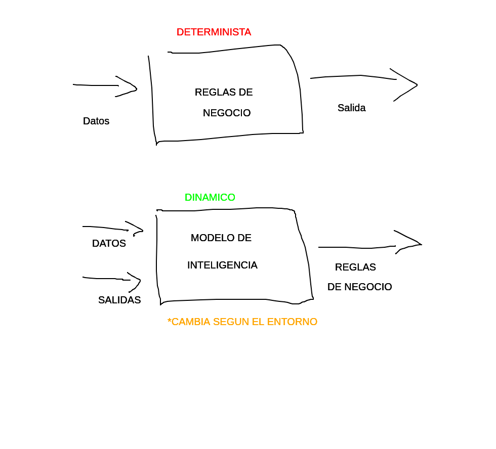
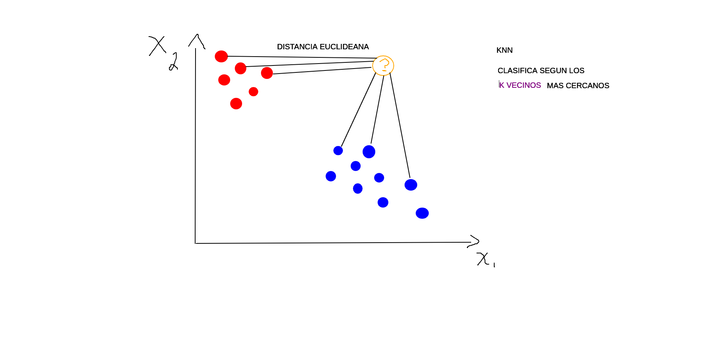

# Sistemas Inteligentes [Teo 1 - Viernes 13:10 - 15:20]
## Notas adicionales
### Forma de evaluación
- 3 evaluaciones teóricas (una por módulo, 20% cada una, a papel)
- Trabajo Final Práctico 40% (Informe, código y presentación)
	- ¿Cuál es el problema?
	- ¿Cómo lo resolvimos?
### Módulos
1. Machine Learning
	- Supervisado
		- Regresión
		- Clasificación
	- No Supervisado
		- Clustering
		- Principal Component Analysis
	- Evaluación de modelos
2. Redes Neuronales (Multi-Layer Perceptrons)
	- Perceptrón multicapa
	- Funciones de activación y backpropagation
	- Regularización y Optimización
3. Modelos de Lenguaje Extensos (LLM)
	- Fundamentos de Natural Language Processing y Transformers
	- Prompt Engineering y aplicaciones prácticas
	- Ética y uso responsable de la IA

## 2025-08-22
#### **Inteligencia - ¿Qué es?**
No hay un concenso para definir la *inteligencia humana* ya que no tiene una definición única.
Objeto de estudio: Machine Learning.
Los sistemas inteligentes son un conjunto de herramientas para resolver problemas pero no todos los problemas deben ser resueltos con inteligencia artificial.

Los algoritmos convencionales son finitos, deterministas y cerrados (ya que no son estocásticos, no tienen dinamismos, no son probabilísticos); estos se pueden asociar más a un árbol (kinda árbol de decisión).
#### ¿Qué define si un sistema puede ser de inteligencia artificial?
Los problemas de la vida real suelen ser dinámicos, si se tiene un problema determinista entonces el **ENTORNO NO CAMBIA** (por ejemplo en las rutas). Un sistema inteligente **IDENTIFICA EL ENTORNO Y TOMA UNA DECISIÓN**.

    

#### Características y áreas
La IA clásica está basada en reglas y lógica, mientras que los SI se basa en datos, patrones y predicciones. Los Sistemas Inteligentes tienen capacidad de aprendizaje, adaptabilidad, autonomía, generalización e interacción.

ML Supervisado y No Supervisado -> Fundamentales
NN incluyen MLP y DL -> Modelos ppotentes
LLM -> Revolución actual
Sistemas híbridos -> Combinación de reglas para mayor aprendizaje
#### ¿Qué es el Machine Learning?
- Aprendizaje automático
	- Permite que las máquinas aprendan y mejoren sin ser programadas explícitamente.
- Entrenamiento de modelos
	- Identifican patrones y los aplican a nuevos datos.
- Reconocimiento de imágenes

**LOS ALGORITMOS NO PIENSAN Y MUCHO MENOS TIENEN CONCIENCIA**; usan técnicas de predicción estadísticas.

"Nosotros traducimos el mundo a matrices y vectores" -> La máquina no ve, no escucha, no habla; la máquina sólo entiende vectores, matrices y tensores.

Algoritmos -> Pensar en matrices y vectores hace más óptimo todo.
#### Tipos de aprendizaje
- Supervisado
	- Datos etiquetados para entrenar
	- Tareas de clasificación
- No supervisado
	- Patrones en datos sin etiquetas
	- Agrupación, segmentación -> clustering
- Por refuerzo
	- Sistema de recompensas y retroalimentación
	- Se usa en robótica y juegos
#### Flujo de trabajo
1. Recolección y preparación de datos
	1. Recopilar
	2. Limpiar
2. Selección y entrenamiento de modelo
	1. Elección
	2. Entrenamiento
3. Evaluación y despliegue
	1. Uso de métricas
	2. Desplegue
#### Definiciones
- Sistemas Inteligentes
	- Sistema computacional capaz de percibir su entorno, procesar información y tomar decisiones autónomas (o semi) con el fin de resolver problemas.
	- Sistemas que buscan replicar procesos cognitivos en máquinas.
	- Aprenden de la experiencia a través de datos y mejoran su rendimiento con el tiempo.
- Determinista
	- Mismas entradas implica mismas salidas.
- Features
	- Atributos observados por el modelo relevantes para el análisis.
- Label
	- Valor objetivo que el modelo busca predecir.
- Estructura de dataset
	- En aprendizaje supervisado, el dataset contiene tanto los features como labels para entrenar modelos.

### Taller
**K-NEAREST NEIGHBOURS**
Primero se calcula la distancia del nuevo punto con respecto a los demás puntos en el espacio vectorial, luego se ordena la distancia de menor a mayor y finalmente se eligen los *k* puntos más cercanos para la clasificación del nuevo punto.

    

Accuracy: Comparación entre lo predicho y lo real.
El modelo KNN tiene 2 problemas principales:
1. El modelo no se auto-entrena porque el hiperparámetro *k* se le tiene que dar.
2. Es muy lento con demasiados datos porque tiene que hacer *n-1* cálculos por y para cada punto.

Actividad Final: https://colab.research.google.com/drive/1qKkQ27kTGw0JlJ_AXglPLya4cYh5lATM?usp=sharing